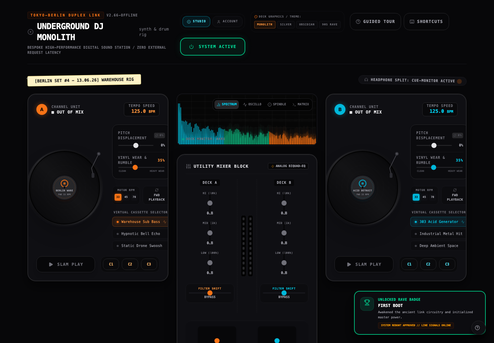
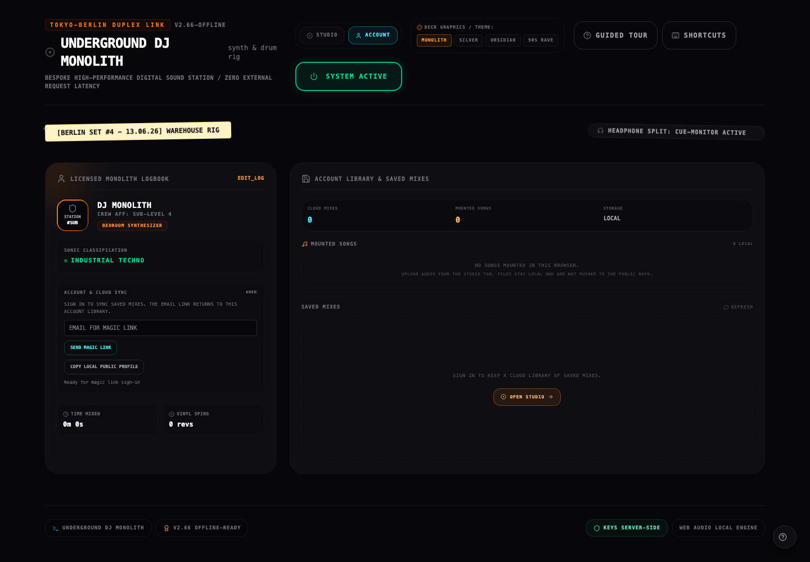
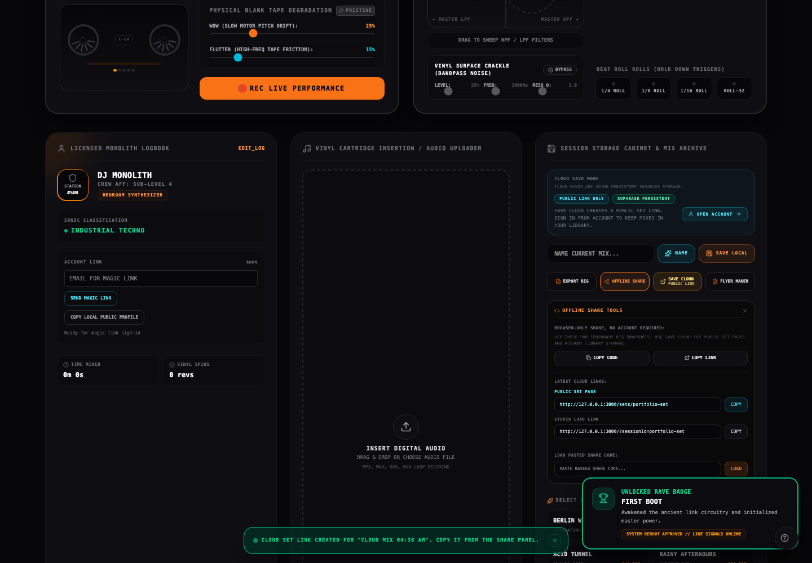

# Underground DJ Monolith

A full-stack, browser-based DJ performance studio built with React, TypeScript, the Web Audio API, Express, Supabase, Render, and Vercel.

The project started as an interactive audio interface and grew into a real portfolio-ready application: users can sign in, save cloud mixes, share public set pages, manage a profile, generate AI-assisted names/flyer copy, and run production health checks without exposing server secrets.

## Live Project

- Frontend: https://underground-dj-deck-2.vercel.app
- Backend health: https://underground-dj-deck-2.onrender.com/api/health
- Repository: https://github.com/jimech/underground-dj-deck-2

## Screenshots

### Studio Console



### Account Library



### Cloud Save And Share Flow



## What This App Does

Underground DJ Monolith is a tactile digital sound station. It combines a stylized DJ console with real browser audio behavior and full-stack persistence.

Core user flows:

- Power on the Web Audio engine from the Studio.
- Mix with two decks, channel controls, EQ, filters, effects, sequencer, sampler, and visualizer.
- Upload local audio files into browser-only deck slots.
- Save mixes locally for offline use.
- Save cloud mixes through the backend and Supabase.
- Share public set pages and studio load links.
- Sign in with Supabase magic links.
- Manage a public DJ profile and account library.
- Generate session names and flyer copy through a server-side Gemini integration.
- Verify production deployment with health checks and deploy doctor scripts.

## Feature Highlights

### Interactive Studio

- Dual turntable UI with cassette-style track slots.
- Mixer, EQ, filters, crossfader, sampler pads, effects, sequencer, and tape recorder surfaces.
- Theme selector with multiple visual treatments.
- Guided tour and keyboard shortcut discovery.
- Dismissible action toasts for save/share/auth feedback.

### Local And Cloud Persistence

- Local browser saves for offline work.
- Cloud saves through Express API.
- Supabase Postgres persistence for production.
- Account-scoped saved mix library.
- Public set URLs for shareable mix pages.
- Separate labels for `Public Set Page` and `Studio Load Link` so users understand what they are copying.

### Account And Public Profile

- Supabase magic-link sign-in.
- Account workspace for saved mixes, mounted local songs, and profile state.
- Public DJ profile links.
- Public set pages that hide private session data.

### Production Safety

- Backend-only Supabase service role key.
- Frontend only receives public `VITE_*` values.
- Secret scanner for tracked and untracked repo files.
- Deploy doctor that checks env readiness without printing secret values.
- API health endpoint shows non-sensitive storage state.
- Production smoke test verifies backend health and frontend SPA route fallbacks.

## Tech Stack

| Layer | Tools |
| --- | --- |
| Frontend | React, TypeScript, Vite, Tailwind CSS, Motion, Lucide Icons |
| Audio | Native Web Audio API, browser decoding, custom WAV export logic |
| Backend | Node.js, Express, TypeScript via `tsx` |
| Database/Auth | Supabase Auth, Supabase Postgres |
| AI | Gemini API through server-only backend routes |
| Testing | Vitest, Playwright |
| Deployment | Vercel frontend, Render backend |
| Safety | Custom secret scanner, deploy doctor, production smoke script |

## Architecture

```text
Browser / Vercel Frontend
  |
  |-- React Studio UI
  |-- Web Audio Engine
  |-- Supabase browser auth client
  |-- Local storage for offline profile/session fallback
  |
  | HTTPS API calls with optional Supabase access token
  v
Render Express API
  |
  |-- /api/health
  |-- /api/sessions
  |-- /api/profiles
  |-- /api/public/sets/:id
  |-- /api/public/profiles/:id
  |-- /api/ai/session-name
  |-- /api/ai/flyer-copy
  |
  | Server-only credentials
  v
Supabase
  |
  |-- Auth users
  |-- dj_sessions
  |-- dj_profiles
```

## Data And Ownership Logic

The app supports both anonymous/local use and signed-in cloud use.

- Signed-out users can still use the Studio, save local mixes, create public cloud links, and copy a local public profile link.
- Signed-in users get account-owned profiles and cloud sessions.
- The frontend sends the Supabase access token to the backend when available.
- The backend verifies the user token with Supabase before listing, updating, or deleting account-owned cloud sessions.
- Public set pages only read sessions marked public/shareable.
- Service role credentials stay on the backend only.

## Web Audio Logic

Most of the performance behavior is client-side:

```text
Deck A / Deck B sample sources
  -> deck EQ and filter controls
  -> crossfader
  -> master output
  -> recorder/export path

Sequencer, sampler, ambient layers, effects
  -> Web Audio graph
  -> visualizer and interaction feedback
```

Notable browser audio features:

- AudioContext starts after user interaction to satisfy browser autoplay rules.
- Uploaded tracks are decoded locally in the browser and are not uploaded to Supabase.
- Recorder/export features compile browser-generated audio into downloadable output.
- The UI keeps audio state serializable so sessions can be saved and restored.

## Project Structure

```text
.
|-- src/
|   |-- App.tsx
|   |-- components/
|   |   |-- UserProfileAndSessionManager.tsx
|   |   |-- Turntable.tsx
|   |   |-- Mixer.tsx
|   |   |-- EffectsRack.tsx
|   |   |-- StepSequencer.tsx
|   |   |-- PublicPages.tsx
|   |   `-- SetPosterGenerator.tsx
|   |-- lib/
|   |   |-- apiClient.ts
|   |   `-- supabaseClient.ts
|   |-- utils/
|   |   |-- audioEngine.ts
|   |   |-- sessionCodec.ts
|   |   `-- presets.ts
|   `-- index.css
|
|-- server/
|   |-- index.ts
|   |-- auth.ts
|   |-- cors.ts
|   |-- rateLimit.ts
|   |-- requestTelemetry.ts
|   |-- aiSessionNaming.ts
|   |-- aiFlyerCopy.ts
|   `-- storage/
|
|-- shared/
|   |-- sessionSchema.ts
|   |-- profileSchema.ts
|   |-- aiSessionNameSchema.ts
|   `-- aiFlyerCopySchema.ts
|
|-- supabase/migrations/
|-- tests/e2e/
|-- scripts/
|   |-- scan-secrets.mjs
|   |-- deploy-doctor.mjs
|   `-- smoke-production.mjs
|
|-- docs/
|   |-- deployment-manual-checklist.md
|   |-- real-app-roadmap.md
|   `-- screenshots/
```

## API Overview

### Health

```http
GET /api/health
```

Returns non-sensitive runtime information:

```json
{
  "ok": true,
  "service": "underground-dj-monolith-api",
  "storage": {
    "configuredDriver": "supabase",
    "activeDriver": "supabase",
    "persistent": true
  }
}
```

### Sessions

```http
POST /api/sessions
GET /api/sessions/:id
GET /api/sessions
PUT /api/sessions/:id
DELETE /api/sessions/:id
```

Anonymous users can create/load public cloud links. Signed-in users can list, rename, and delete their own cloud sessions.

### Profiles

```http
GET /api/profiles/:id
PUT /api/profiles/:id
GET /api/public/profiles/:id
```

Profiles sync locally and to Supabase when the backend is available.

### Public Pages

```http
GET /api/public/sets/:id
GET /api/public/profiles/:id
```

Public endpoints return display-safe fields only.

### AI

```http
POST /api/ai/session-name
POST /api/ai/flyer-copy
```

Gemini calls run on the backend. `GEMINI_API_KEY` is never exposed to the frontend.

## Local Development

Install dependencies:

```bash
npm install
```

Run the frontend:

```bash
npm run dev
```

Run the backend:

```bash
npm run server
```

Run both in separate terminals, or use:

```bash
npm run dev:full
```

Frontend:

```text
http://localhost:3000
```

Backend:

```text
http://localhost:8787/api/health
```

## Environment Variables

Create a local `.env` file for development. Do not commit it.

### Frontend-safe values

These are public browser config values:

```bash
VITE_API_BASE_URL="http://localhost:8787"
VITE_SUPABASE_URL="https://YOUR_PROJECT_REF.supabase.co"
VITE_SUPABASE_ANON_KEY="YOUR_SUPABASE_ANON_OR_PUBLISHABLE_KEY"
```

### Backend-only values

These must stay server-side:

```bash
APP_URL="http://localhost:3000"
SESSION_STORAGE_DRIVER="supabase"
SUPABASE_URL="https://YOUR_PROJECT_REF.supabase.co"
SUPABASE_SERVICE_ROLE_KEY="YOUR_SERVER_ONLY_SUPABASE_SERVICE_ROLE_KEY"
GEMINI_API_KEY="YOUR_SERVER_ONLY_GEMINI_KEY"
```

Optional:

```bash
CORS_ALLOWED_ORIGINS="https://preview.example.com"
AI_RATE_LIMIT_MAX=20
AI_RATE_LIMIT_WINDOW_MS=600000
WRITE_RATE_LIMIT_MAX=120
WRITE_RATE_LIMIT_WINDOW_MS=600000
SHUTDOWN_GRACE_MS=10000
```

## Supabase Setup

Run the migrations in order:

```text
supabase/migrations/202606160001_create_dj_sessions.sql
supabase/migrations/202606160002_create_dj_profiles.sql
supabase/migrations/202606160003_add_user_id_to_dj_profiles.sql
supabase/migrations/202606160004_add_ownership_to_dj_sessions.sql
```

Then configure Supabase Auth:

```text
Site URL:
https://underground-dj-deck-2.vercel.app

Redirect URLs:
http://localhost:3000
https://underground-dj-deck-2.vercel.app
```

## Deployment

Production deployment uses:

- Render for the Express API.
- Vercel for the Vite frontend.
- Supabase for Auth and Postgres persistence.

Backend Render settings:

```text
Build Command: npm ci
Start Command: npm run server
Health Check Path: /api/health
```

Frontend Vercel settings:

```text
Framework Preset: Vite
Build Command: npm run build
Output Directory: dist
```

See the full checklist:

```text
docs/deployment-manual-checklist.md
```

## Verification Commands

Run all local safety checks:

```bash
npm run verify
```

Run the secret scanner:

```bash
npm run secret:scan
```

Check local env readiness without printing secret values:

```bash
npm run deploy:doctor
```

Check production env readiness:

```bash
npm run deploy:doctor:prod
```

Run production smoke checks:

```bash
API_URL="https://underground-dj-deck-2.onrender.com" \
FRONTEND_URL="https://underground-dj-deck-2.vercel.app" \
EXPECT_STORAGE_DRIVER="supabase" \
npm run smoke:prod
```

Current passing test suite:

```text
7 Vitest files / 19 unit tests
7 Playwright end-to-end tests
Production build
Secret scan
Production smoke test
```

## Security Notes

- `.env` is ignored and must not be committed.
- `SUPABASE_SERVICE_ROLE_KEY` is backend-only.
- `GEMINI_API_KEY` is backend-only.
- `VITE_*` variables are public in the browser.
- The custom secret scanner detects common API keys, private keys, database URLs with passwords, and Supabase service-role JWTs.
- Backend logs include request IDs and status metadata, but not raw tokens, request bodies, or API keys.

## Portfolio Notes

This project demonstrates:

- Full-stack product development from prototype to deployed app.
- Browser-native audio engineering with a complex interactive UI.
- Authenticated persistence and public sharing.
- API design with validation, ownership checks, rate limits, and CORS.
- Secure deployment practices with environment separation.
- Test coverage across unit, API helper, and browser workflows.
- Production readiness through smoke checks, health checks, and deploy diagnostics.

## Future Improvements

- Add a richer public gallery of featured sets.
- Add custom domains for frontend and API.
- Add analytics for public set views.
- Add explicit audio upload storage as a separate opt-in feature.
- Add more mobile-specific performance controls.
